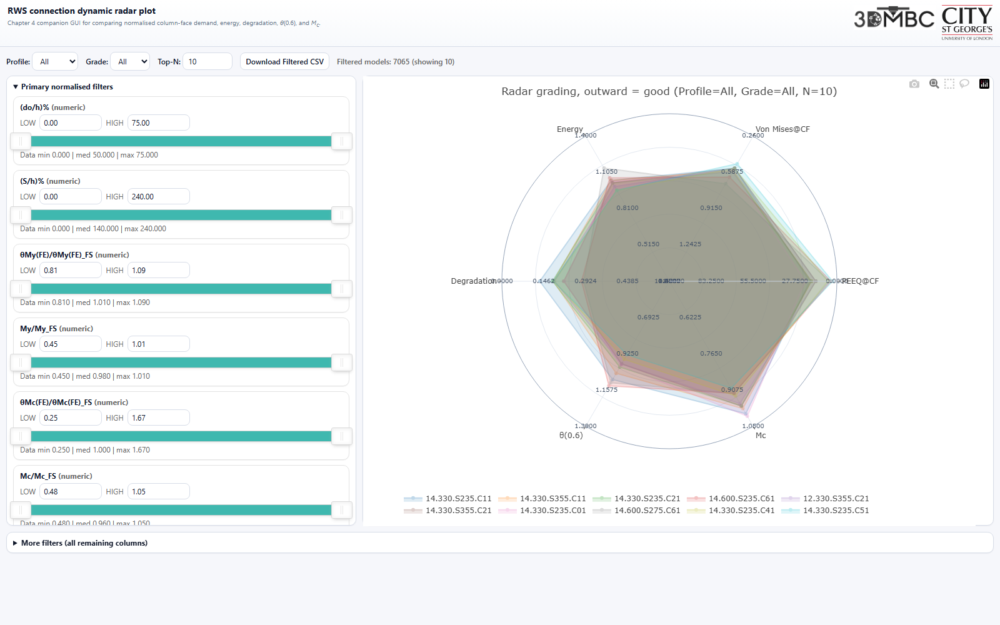
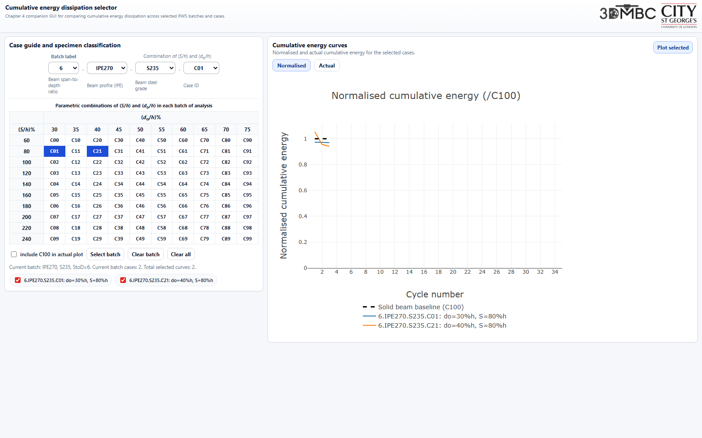
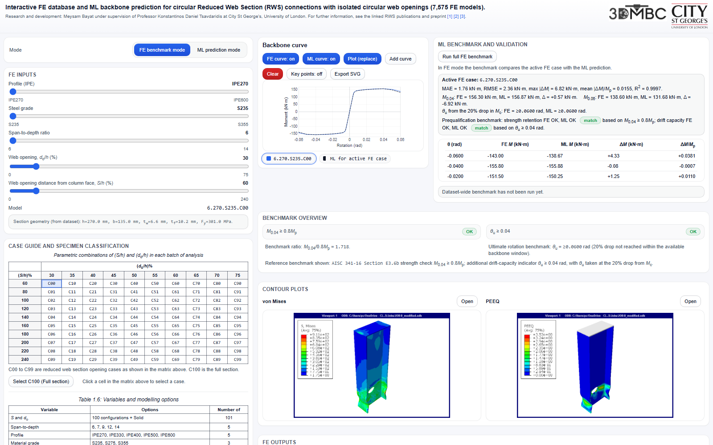

# RWS PhD Thesis GUIs

Companion graphical user interfaces for my PhD thesis on reduced web section (RWS) connections for seismic retrofitting.

Suggested GitHub repository description:

> Useful GUIs for my PhD thesis on RWS connections for seismic retrofitting.

## Live GUIs

| Thesis chapter | GUI | Purpose | Live link |
|---|---|---|---|
| Chapter 4 | Reduced Web Section Explorer | FE-derived RWS geometry screening, backbone response, and column-face demand. | [Open GUI](https://gitmeysambayat.github.io/rws-gui/) |
| Chapter 4 | RWS Connection Dynamic Radar Plot | Normalised comparison of column-face demand, energy dissipation, degradation, theta(0.6), and column-face moment demand. | [Open GUI](https://gitmeysambayat.github.io/RWS-connection-Dynamic-Radar-plot/) |
| Chapter 4 | Cumulative Energy Dissipation for RWS Connections | Batch-wise comparison of cumulative energy dissipation trends across RWS connection models. | [Open GUI](https://gitmeysambayat.github.io/EnergyDissipation-RWS_Connections/) |
| Chapter 7 | Machine-Learning-Based Prediction of Backbone Curves for RWS Connections | Interactive FE and ML comparison for predicting backbone curves of RWS connections. | [Open GUI](https://gitmeysambayat.github.io/rws_gui_merged_FE_ML/) |

## Screenshots

### Chapter 4, Reduced Web Section Explorer

### Chapter 4, Dynamic Radar Plot

### Chapter 4, Cumulative Energy Dissipation

### Chapter 7, FE and ML Backbone Prediction

## Repository Links

- [Reduced-Web-Section-Explorer](https://github.com/gitmeysambayat/rws-gui)
- [RWS-Connections-Dynamic-Radar-Plot](https://github.com/gitmeysambayat/RWS-connection-Dynamic-Radar-plot)
- [Cumulative-Energy-Dissipation-RWS-Connections](https://github.com/gitmeysambayat/EnergyDissipation-RWS_Connections)
- [Machine-Learning-Based Prediction of Backbone Curves for RWS Connections](https://github.com/gitmeysambayat/rws_gui_merged_FE_ML)

## Research Context

The tools support visual interrogation of finite element and machine learning outputs for RWS connection behaviour, including cyclic response, moment-rotation backbone response, cumulative energy dissipation, and column-face demand.

Relevant linked outputs:

- [Frontiers in Built Environment article](https://doi.org/10.3389/fbuil.2025.1592665)
- [ce/papers conference paper](https://doi.org/10.1002/cepa.70170)
- [Research Square preprint](https://doi.org/10.21203/rs.3.rs-8506924/v1)

## Local Use

Clone the individual GUI repositories or open the live links above. The GUIs are static browser-based tools and do not require a local server for normal viewing.
