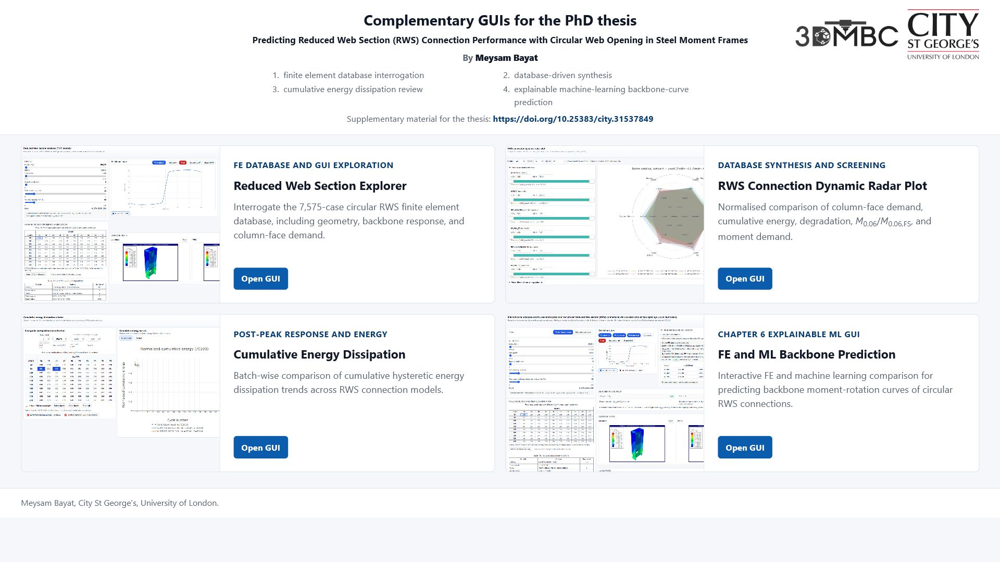

# Complementary GUIs for the PhD thesis

Complementary GUIs for my PhD thesis "Predicting Reduced Web Section (RWS) Connection Performance with Circular Web Opening in Steel Moment Frames".

This repository is the single consolidated home for the browser-based GUI tools associated with the thesis. The GUIs are organised by their role in the thesis evidence base, rather than by a single chapter label, because the database interrogation tools support the finite element database generation, database-driven synthesis, and supplementary screening workflow.

## Live Site

[Open the consolidated GUI site](https://gitmeysambayat.github.io/RWS-PhD-Thesis-GUIs/)

## GUIs Included

| Thesis placement | GUI | Local path | Live link |
|---|---|---|---|
| FE database and database-driven synthesis | Reduced Web Section Explorer | `database-guis/rws-explorer/` | [Open GUI](https://gitmeysambayat.github.io/RWS-PhD-Thesis-GUIs/database-guis/rws-explorer/) |
| Design-oriented database screening | RWS Connection Dynamic Radar Plot | `database-guis/dynamic-radar-plot/` | [Open GUI](https://gitmeysambayat.github.io/RWS-PhD-Thesis-GUIs/database-guis/dynamic-radar-plot/) |
| Post-peak response and cumulative energy dissipation | Cumulative Energy Dissipation for RWS Connections | `database-guis/energy-dissipation/` | [Open GUI](https://gitmeysambayat.github.io/RWS-PhD-Thesis-GUIs/database-guis/energy-dissipation/) |
| Chapter 6, explainable machine-learning surrogate and GUI | FE and ML Backbone Prediction for RWS Connections | `chapter-6-ml-backbone-gui/` | [Open GUI](https://gitmeysambayat.github.io/RWS-PhD-Thesis-GUIs/chapter-6-ml-backbone-gui/) |

## Screenshots

### FE Database, Reduced Web Section Explorer

### Database Screening, Dynamic Radar Plot

### Post-Peak Response, Cumulative Energy Dissipation

### Chapter 6, FE and ML Backbone Prediction

## Research Context

The GUIs support visual interrogation of finite element and machine learning outputs for circular RWS connection behaviour, including cyclic response, moment-rotation backbone response, cumulative energy dissipation, and column-face demand. In the submitted thesis, the three database GUIs are associated with the finite element database and database-driven synthesis workflow, while the ML backbone prediction GUI belongs to Chapter 6, "Explainable Machine-Learning-Based Prediction of Backbone Curves and GUI".

Relevant linked outputs:

- [Frontiers in Built Environment article](https://doi.org/10.3389/fbuil.2025.1592665)
- [ce/papers conference paper](https://doi.org/10.1002/cepa.70170)
- [Research Square preprint](https://doi.org/10.21203/rs.3.rs-8506924/v1)

## Repository Organisation

This repository is intended to replace the scattered thesis GUI repositories on my GitHub profile. After confirming that the consolidated GitHub Pages links work, the older standalone thesis GUI repositories can be deleted or archived.
