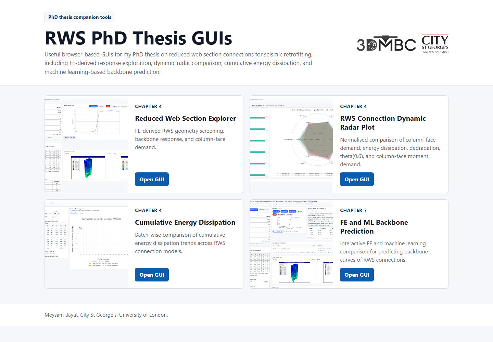

# RWS PhD Thesis GUIs

Useful GUIs for my PhD thesis on reduced web section (RWS) connections for seismic retrofitting.

This repository is the single consolidated home for the browser-based GUI tools associated with the thesis. The GUIs are grouped by thesis chapter and can be opened directly through GitHub Pages.

## Live Site

[Open the consolidated GUI site](https://gitmeysambayat.github.io/RWS-PhD-Thesis-GUIs/)

## GUIs Included

| Thesis chapter | GUI | Local path | Live link |
|---|---|---|---|
| Chapter 4 | Reduced Web Section Explorer | `chapter-4/rws-explorer/` | [Open GUI](https://gitmeysambayat.github.io/RWS-PhD-Thesis-GUIs/chapter-4/rws-explorer/) |
| Chapter 4 | RWS Connection Dynamic Radar Plot | `chapter-4/dynamic-radar-plot/` | [Open GUI](https://gitmeysambayat.github.io/RWS-PhD-Thesis-GUIs/chapter-4/dynamic-radar-plot/) |
| Chapter 4 | Cumulative Energy Dissipation for RWS Connections | `chapter-4/energy-dissipation/` | [Open GUI](https://gitmeysambayat.github.io/RWS-PhD-Thesis-GUIs/chapter-4/energy-dissipation/) |
| Chapter 7 | FE and ML Backbone Prediction for RWS Connections | `chapter-7/fe-ml-backbone/` | [Open GUI](https://gitmeysambayat.github.io/RWS-PhD-Thesis-GUIs/chapter-7/fe-ml-backbone/) |

## Screenshots

### Chapter 4, Reduced Web Section Explorer

### Chapter 4, Dynamic Radar Plot

### Chapter 4, Cumulative Energy Dissipation

### Chapter 7, FE and ML Backbone Prediction

## Research Context

The GUIs support visual interrogation of finite element and machine learning outputs for RWS connection behaviour, including cyclic response, moment-rotation backbone response, cumulative energy dissipation, and column-face demand.

Relevant linked outputs:

- [Frontiers in Built Environment article](https://doi.org/10.3389/fbuil.2025.1592665)
- [ce/papers conference paper](https://doi.org/10.1002/cepa.70170)
- [Research Square preprint](https://doi.org/10.21203/rs.3.rs-8506924/v1)

## Repository Organisation

This repository is intended to replace the scattered thesis GUI repositories on my GitHub profile. After confirming that the consolidated GitHub Pages links work, the older standalone thesis GUI repositories can be deleted or archived.
