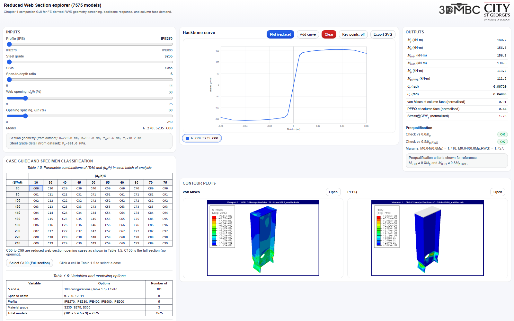

# Reduced Web Section Explorer

## Live GUI

[Open the Reduced Web Section Explorer](https://gitmeysambayat.github.io/rws-gui/)

## Purpose

This Chapter 4 companion GUI supports rapid interrogation of the finite-element database embedded in `index.html`. It is designed for circular Reduced Web Section (RWS) connection screening, with controls for beam profile, steel grade, span-to-depth ratio, opening diameter ratio <i>d</i>o/<i>h</i>, and opening distance ratio <i>S</i>/<i>h</i>.

The interface reports backbone response, characteristic moments, column-face von Mises stress, column-face PEEQ, and qualification-style margin indicators. Where contour assets are available, the selected case also displays von Mises and PEEQ contour images.

## Engineering Context

RWS connections are a beam-weakening retrofit concept in which a web opening is used to attract inelastic action away from the beam-column interface while preserving the beam flanges [1]. This GUI is a screening and visualisation tool, not a replacement for project-specific seismic assessment, detailing checks, or code-mandated qualification.

## Repository Contents

- `index.html`: standalone GUI with embedded FE-derived response data.
- `contours/`: von Mises and PEEQ contour image assets.
- `3DMBC_logo.png`, `city-st-georges-responsive-logo.svg`, `favicon_3dmbc.png`: branding and icon assets.
- `screenshots/20260605_v1_RWSExplorer.png`: README screenshot.

## Local Use

Open `index.html` directly in a browser or serve the repository root with any static HTTP server. No build step is required.

## References

[1] M. Bayat, K. D. Tsavdaridis, and A. Alonso-Rodriguez, "A case study for optimising the geometry and moment capacity of code compliant welded RWS connections," *Frontiers in Built Environment*, 2025. DOI: [10.3389/fbuil.2025.1592665](https://doi.org/10.3389/fbuil.2025.1592665).

[2] M. Bayat, K. D. Tsavdaridis, and A. Alonso-Rodriguez, "Evaluation of Reduced Web Section (RWS) Connections Subjected to Cyclic Loading," *ce/papers*, 2025. DOI: [10.1002/cepa.70170](https://doi.org/10.1002/cepa.70170).
