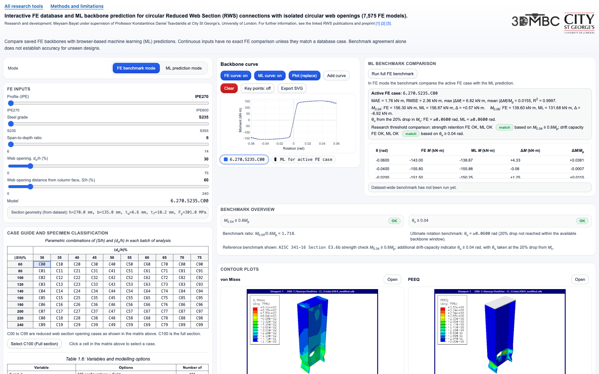

# FE and ML backbone comparison for RWS connections

Compare finite element (FE) backbone curves with machine-learning (ML) predictions for circular Reduced Web Section (RWS) connections. This Chapter 6 thesis companion combines a saved FE database with **browser-side inference from an exported XGBoost tree ensemble**.

**[Open the FE and ML tool](https://gitmeysambayat.github.io/RWS-PhD-Thesis-GUIs/chapter-6-ml-backbone-gui/)** · [Methods and limitations](../methods.html) · [All tools](../README.md)

## Use

1. In **FE benchmark mode**, choose a database case and compare its stored FE curve with the model prediction. To retain an FE curve, press **Add curve** before changing the case; the first curve follows the controls. Toggle the overlays or export the plot as SVG or PNG.
2. In **ML prediction mode**, vary the geometry controls within their permitted ranges. An exact FE comparison and associated contour images appear only when the inputs match a database case.
3. Inspect the selected-case moment differences and curve error measures. **Run full FE benchmark** compares predictions with all 7,575 embedded FE cases.

The controls support five IPE profiles and three steel grades. The span-to-depth control ranges from 6 to 14; opening diameter is 30–75% of depth and opening distance from the column face is 60–240% of depth. A zero opening selects the full-section case. These are interface bounds, not a guarantee of accuracy throughout that space.

## Implementation and evidence

`index.html` loads `xgb_model.json` and traverses its 400 trees in JavaScript. The model returns 21 normalised moment ordinates, which the interface scales by the section plastic moment to plot a backbone in kN·m at the stored rotation levels from −0.06 to +0.06 rad. Predictions are computed when the inputs change; they are not a lookup of saved ML curves.

The embedded FE data is the same dataset used by the Explorer. A full-database benchmark measures agreement with those reference curves; the repository does not provide the training pipeline or train/test split needed to establish independent predictive validation. See the methods page for the span-notation and exported-field provenance qualifications. Displayed strength or rotation thresholds do not establish connection qualification.

## Files and local use

- `index.html`: interface, FE dataset, model loading, inference, comparisons and SVG plotting.
- `xgb_model.json`: exported tree ensemble and feature names.
- `contours/`: case-labelled FE contour images, organised by grade and profile.
- `screenshots/`: interface screenshot; the remaining image assets are logos and icons.

From the **repository root**, run `python3 -m http.server 8000 --bind 127.0.0.1`, then open [the local FE and ML tool](http://127.0.0.1:8000/chapter-6-ml-backbone-gui/). Keep `xgb_model.json` beside `index.html`. Serving over HTTP allows the browser to load the model; opening the HTML directly can block that request.

Developed by Meysam Bayat as a companion to the RWS thesis. See the [repository research sources, credits and reuse terms](../README.md#repository-and-research-sources).
