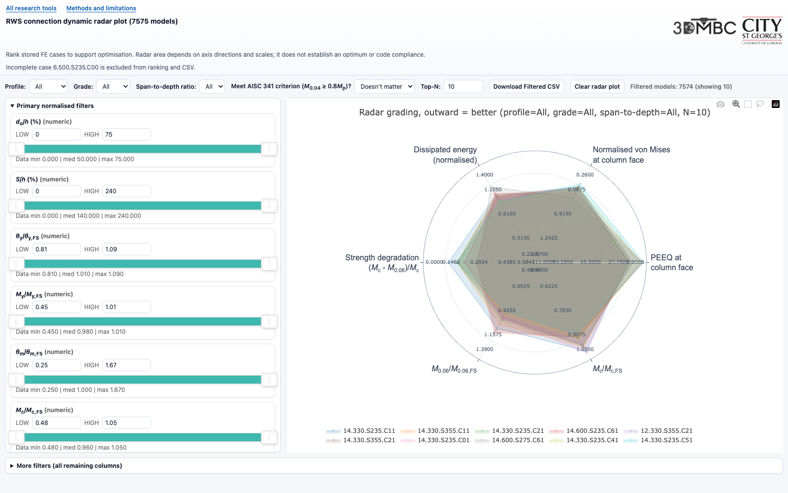

# RWS dynamic radar comparison

Filter and rank saved finite element (FE) results to shortlist circular Reduced Web Section (RWS) configurations for optimisation studies.

**[Open the radar comparison](https://gitmeysambayat.github.io/RWS-PhD-Thesis-GUIs/database-guis/dynamic-radar-plot/)** · [Methods and limitations](../../methods.html) · [All tools](../../README.md)

## Use and interpretation

Choose profile, grade and span-to-depth filters, then adjust the numerical ranges. **Top N** limits the plotted cases; the counter reports the full filtered set.

The six spokes are column-face PEEQ, normalised column-face von Mises response, normalised energy, strength degradation, moment at 0.06 rad relative to the full section, and peak moment relative to the full section. PEEQ denotes equivalent plastic strain.

Fixed global ranges keep scales consistent. The preferred direction is outward, and polygon area determines rank. Ranking depends on the metric definitions, ranges and spoke order; it does not establish an optimum or connection qualification.

**Download Filtered CSV** requests a password and exports the full filtered set, including cases beyond Top N. Incomplete case `6.500.S235.C00` is excluded from ranking and export; the stored data and global ranges are retained. This tool runs no FE analysis or ML inference.

## Files and local use

- `index.html`: entry point redirecting to the application.
- `RWS_radar_dynamic.html`: embedded dataset, filtering, radar scoring and CSV export.

From the **repository root**, run `python3 -m http.server 8000 --bind 127.0.0.1`, then open [the local radar comparison](http://127.0.0.1:8000/database-guis/dynamic-radar-plot/). Internet access is needed for Plotly.js and noUiSlider, loaded from public CDNs.

By Meysam Bayat. [Research sources and reuse terms](../../README.md#repository-and-research-sources).
