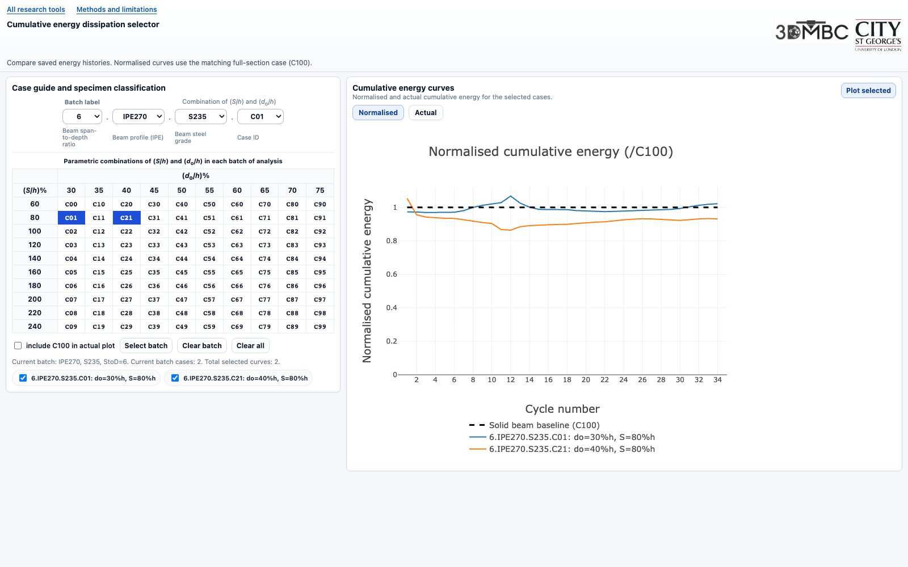

# Cumulative energy comparison for RWS connections

Compare saved cumulative hysteretic energy curves for circular Reduced Web Section (RWS) connections across profiles, grades and span-to-depth settings.

**[Open the energy comparison](https://gitmeysambayat.github.io/RWS-PhD-Thesis-GUIs/database-guis/energy-dissipation/)** · [Methods and limitations](../../methods.html) · [All tools](../../README.md)

## Use

1. Choose a batch using the span-to-depth, profile and grade selectors.
2. Press **Clear all** to remove the default C01/C21 selection, then choose cases from the matrix or case selector. Selections persist across batches; remove individual curves from the selected-case list.
3. Choose **Plot selected**, then switch between **Normalised** and **Actual**.

**Normalised** plots per-cycle energy ratios against the batch's full-section reference, **C100**, with a baseline at 1. **Actual** plots the stored energy in **kJ** against cycle number; tick **include C100** to add each batch's reference curve.

The browser plots stored arrays; it does not integrate new hysteresis data or run FE analyses. Case `6.500.S235.C00` has 26 cycle points; the others have 34. Compare compatible loading sequences. Energy alone does not establish seismic qualification.

## Files and local use

- `index.html`: entry point redirecting to the application.
- `batches_with_plots.html`: interface, embedded energy data and Plotly animation.

From the **repository root**, run `python3 -m http.server 8000 --bind 127.0.0.1`, then open [the local energy comparison](http://127.0.0.1:8000/database-guis/energy-dissipation/). Internet access is needed for Plotly.js, loaded from a public CDN.

By Meysam Bayat. [Research sources and reuse terms](../../README.md#repository-and-research-sources).
