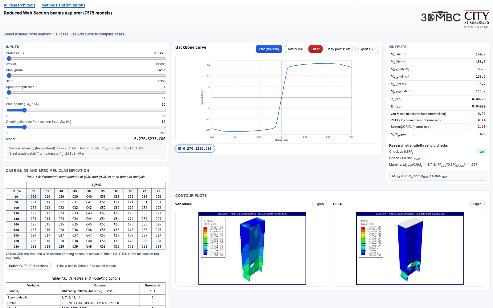

# Reduced Web Section Beams Explorer

Compare saved finite element (FE) backbones, response measures and contour images for circular Reduced Web Section (RWS) connections.

**[Open the Explorer](https://gitmeysambayat.github.io/RWS-PhD-Thesis-GUIs/database-guis/rws-explorer/)** · [Methods and limitations](../../methods.html) · [All tools](../../README.md)

## Use

1. Choose an IPE profile, steel grade and span-to-depth setting.
2. Select an opening case from the matrix or geometry controls. **C100** selects the full-section reference.
3. Press **Add curve** before changing cases to retain the current curve. The first curve follows the controls. Use **Key points** to show characteristic moments; export as SVG or PNG.
4. Inspect von Mises and equivalent plastic strain (PEEQ) contours.

The database holds 7,575 cases, with moment in kN·m and rotation in rad. Selection retrieves stored results; it does not run FE analyses. Case `6.500.S235.C00` lacks backbone ordinates from ±0.03 to ±0.06 rad.

The strength-retention check alone does not establish connection qualification or design compliance.

## Files and local use

- `index.html`: interface, embedded FE dataset and JavaScript/SVG plotting.
- `contours/`: case-labelled von Mises and PEEQ images, organised by grade and profile.

From the **repository root**, run `python3 -m http.server 8000 --bind 127.0.0.1`, then open [the local Explorer](http://127.0.0.1:8000/database-guis/rws-explorer/). No build step is required.

By Meysam Bayat. [Research sources and reuse terms](../../README.md#repository-and-research-sources).
